---
# required metadata

title: Deploying Microsoft Identity Manager Certificate Manager | Microsoft Docs
description: Install Microsoft Identity Manager 2016 Certificate Manager
keywords:
author: barclayn
ms.author: barclayn
manager: mbaldwin
ms.date: 08/15/2017
ms.topic: article
ms.service: microsoft-identity-manager
ms.technology: security
ms.assetid:


---


# Deploying Microsoft Identity Manager Certificate Manager 2016 (MIM CM)

## Assumptions…

The installation of MIM CM requires that you take several steps. To simplify things the process is broken into:
1. Deployment Overview
2. Pre-deployment steps


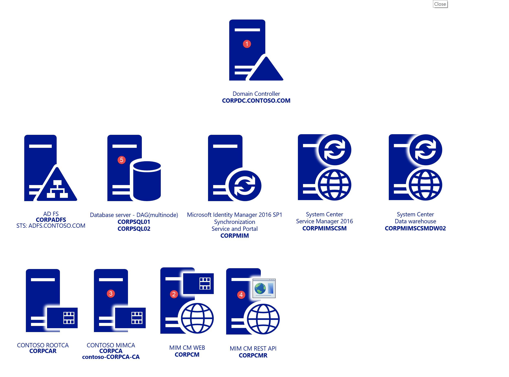

Windows 2016 Datacenter Servers used in this setup:

1.  CORPDC – Domain Controller

2.  CORPCM – MIM CM Server

3.  CORPCA – Certificate Authority

4.  CORPCMR – MIM CM Rest API Web – CM Portal For Rest API – Used for later

5.  CORPSQL1 – SQL 2016 SP1

6.  CORPWK1 – Windows 10 Domain Joined

## Deployment overview


-   Base operating system installation

    -   The lab consists of windows 2016 Datacenter servers.

       >[!NOTE] For more details on the supported platforms for MIM 2016 take a look at the article titled [Supported platforms for MIM 2016](/microsoft-identity-manager/microsoft-identity-manager-2016-supported-platforms.md)

-   Pre-deployment steps

    - [Extending the schema](https://msdn.microsoft.com/library/ms676929(v=vs.85).aspx)

    - Creating service accounts

    - [Creating certificate templates](https://technet.microsoft.com/library/cc753370(v=ws.11).aspx)

    - IIS

    - Configuring Kerberos

    - Database-related steps

      - SQL configuration requirements

      - Database permissions

- Deployment

## Pre-deployment steps

The MIM CM configuration wizard requires information to be provided along the way in order for it to complete successfully. The pre-deployment steps will (INCOMPLETE THOUGHT HERE)


### Extending the schema

The process of extending the schema is straightforward but must be approached with caution due to its irreversible nature.

>[!NOTE]
This step requires that the account used has schema admin rights.

- Browse to the location of the MIM media and navigate to \\Certificate Management\\x64 folder.

- Copy the Schema folder to CORPDC then navigate to it.

    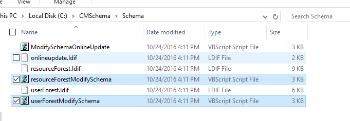

- Run the script resourceForestModifySchema.vbs single Forest scenario

- For the Resource forest scenario run the scripts:
  - DomainA – Users located (userForestModifySchema.vbs)
  - ResourceForestB – Location of CM installation
        (resourceForestModifySchema.vbs)

>[!NOTE]
Schema changes are a one way operation and require a forest recovery to roll back so make sure you have necessary backups. For details on the changes made to the schema by performing this operation review the article [Forefront Identity Manager 2010 Certificate Management Schema Changes](https://technet.microsoft.com/library/jj159298(v=ws.10).aspx)

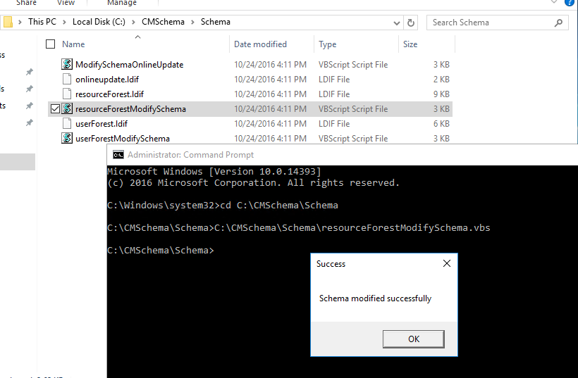

Run the script and you should receive a success message once that the script completes.

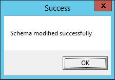

The schema in AD is now extended to support MIM CM.

### Creating service accounts and groups

The following table summarizes the accounts and permissions required by MIM CM.
You can allow the MIM CM create the following accounts automatically, or you can
create them prior to installation. The actual account names can be changed. If
you do create the accounts yourself, consider naming the user accounts in such a
way that it is easy to match the user account name to its function.

Users:


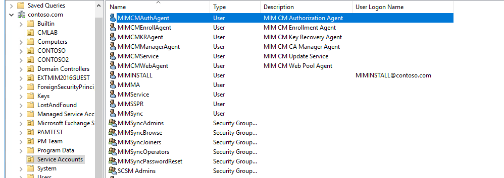

| **Role**                   | **User log on name** |
|----------------------------|---------------------|
| MIM CM Agent               | MIMCMAgent          |
| MIM CM Key Recovery Agent  | MIMCMKRAgent        |
| MIM CM Authorization Agent | MIMCMAuthAgent      |
| MIM CM CA Manager Agent    | MIMCMManagerAgent   |
| MIM CM Web Pool Agent      | MIMCMWebAgent       |
| MIM CM Enrollment Agent    | MIMCMEnrollAgent    |
| MIM CM Update Service      | MIMCMService        |
| MIM Install Account        | MIMINSTALL          |
| Help Desk Agent            | CMHelpdesk1-2       |
| CM Manager                 | CMManager1-2        |
| Subscriber User            | CMUser1-2           |

Groups:

| **Role**               | **Group**         |
|------------------------|-------------------|
| CM Helpdesk Members    | MIMCM-Helpdesk    |
| CM Manager Members     | MIMCM-Managers    |
| CM Subscribers Members | MIMCM-Subscribers |

Powershell: Agent Accounts

```
import-module activedirectory
## Agent accounts used during setup
$cmagents = @{
"MIMCMKRAgent" = "MIM CM Key Recovery Agent"; 
"MIMCMAuthAgent" = "MIM CM Authorization Agent"
"MIMCMManagerAgent" = "MIM CM CA Manager Agent";
"MIMCMWebAgent" = "MIM CM Web Pool Agent";
"MIMCMEnrollAgent" = "MIM CM Enrollment Agent";
"MIMCMService" = "MIM CM Update Service";
"MIMCMAgent" = "MIM CM Agent";
}
##Groups Used for CM Management
$cmgroups = @{
"MIMCM-Managers" = "MIMCM-Managers"
"MIMCM-Helpdesk" = "MIMCM-Helpdesk"
"MIMCM-Subscribers" = "MIMCM-Subscribers" 
}
##Users Used during testlab
$cmusers = @{
"CMManager1" = "CM Manager1"
"CMManager2" = "CM Manager2"
"CMUser1" = "CM User1"
"CMUser2" = "CM User2"
"CMHelpdesk1" = "CM Helpdesk1"
"CMHelpdesk2" = "CM Helpdesk2"
}

## OU Paths
$aoupath = "OU=Service Accounts,DC=contoso,DC=com" ## Location of Agent accounts
$oupath = "OU=CMLAB,DC=contoso,DC=com" ## Location of Users and Groups for CM Lab


#Create Agents – Update UserprincipalName
$cmagents.GetEnumerator() | Foreach-Object { 
New-ADUser -Name $_.Name -Description $_.Value -UserPrincipalName ($_.Name + "@contoso.com")  -Path $aoupath
$cmpwd = ConvertTo-SecureString "Pass@word1" –asplaintext –force
Set-ADAccountPassword –identity $_.Name –NewPassword $cmpwd
Set-ADUser -Identity $_.Name -Enabled $true
}


#Create Users
$cmusers.GetEnumerator() | Foreach-Object { 
New-ADUser -Name $_.Name -Description $_.Value -Path $oupath
$cmpwd = ConvertTo-SecureString "Pass@word1" –asplaintext –force
Set-ADAccountPassword –identity $_.Name –NewPassword $cmpwd
Set-ADUser -Identity $_.Name -Enabled $true
}
```

### Update **CORPCM** Server Local Policy for Agent Accounts 

| **User log on name** | **Description and permissions**   |
|------|---------------------|
| MIMCMAgent          | Provides the following services: </br>-   Retrieves encrypted private keys from the CA. </br>-   Protects smart card PIN information in the FIM CM database. </br>-   Protects communication between FIM CM and the CA. </br></br> This user account requires the following access control settings:</br>-   **Allow logon locally** user right.</br>-   **Issue and Manage Certificates** user right. </br>-   Read and Write permission on the system Temp folder at the following location: %WINDIR%\\Temp.</br>-   A digital signature and encryption certificate issued and installed in the user store.
|MIMCMKRAgent        | Recovers archived private keys from the CA. This user account requires the following access control settings:</br> -   **Allow logon locally** user right.</br>-   Membership in the local **Administrators** group. </br>-   Enroll permission on the **KeyRecoveryAgent** certificate template. </br>-   Key Recovery Agent certificate is issued and installed in the user store. The certificate must be added to the list of the key recovery agents on the CA. </br>-   Read permission and Write permission on the system Temp folder at the following location: ```%WINDIR%\\Temp.```                                                                                                                     |
| MIMCMAuthAgent      | Determines user rights and permissions for users and groups. This user account requires the following access control settings: </br>-   Membership in the Pre-Windows 2000 Compatible Access domain group. </br> -   Granted the **Generate security audits** user right.             |
| MIMCMManagerAgent   | Performs CA management activities. </br> This user must be assigned the Manage CA permission.        |
| MIMCMWebAgent       | Provides the identity for the IIS application pool. FIM CM runs within a Microsoft Win32® application programming interface process that uses this user’s credentials. </br> This user account requires the following access control settings:</br> -   Membership in the local **IIS_WPG, windows 2016 = IIS_IUSRS** group. </br>-   Membership in the local **Administrators** group.</br>-   Granted the **Generate security audits** user right. </br>-   Granted the **Act as part of the operating system** user right. </br>-   Granted the **Replace process level token** user right.</br>-   Assigned as the identity of the IIS application pool, **CLMAppPool**. </br>-   Granted Read permission on the    **HKEY_LOCAL_MACHINE\\SOFTWARE\\Microsoft\\CLM\\v1.0\\Server\\WebUser** registry key. </br>-   This account must also be trusted for delegation.|
| MIMCMEnrollAgent    | Performs enrollment on behalf of a user. This user account requires the following access control settings:</br>-   An Enrollment Agent certificate that is issued and installed in the user store.</br>-   **Allow logon locally** user right. </br>-   Enroll permission on the **Enrollment Agent** certificate template (or the custom template, if one is used).                 |

### Creating certificate templates for MIM CM service accounts

Three of the service accounts used by MIM CM require a certificate and the configuration wizard requires that you provide the name of the certificates templates that it should use to request certificates for them.

The service accounts that require certificates are:

- MIMCMAgent: This account needs a user certificate

- MIMCMEnrollAgent: This account needs an enrollment agent certificate

- MIMCMKRAgent: This account needs a **Key recovery agent** certificate

There are templates already present in AD, but we need to create our own versions to work with MIM CM. As we need to make modification from the original baseline templates.

All three of the above accounts will have elevated rights within your organization and should be handled carefully.

#### Create the MIM CM Signing certificate template

1. From **Administrative Tools**, open **Certification Authority**.
2. In the **Certification Authority** console, in the console tree, expand **Contoso-CorpCA**, and then click **Certificate Templates**.
3. Right-click **Certificate Templates**, and then click **Manage**.
4. In the **Certificate Templates Console**, in the **details** pane, select and right-click **User**, and then click **Duplicate Template**.
5. In the **Duplicate Template** dialog box, select **Windows Server 2003 Enterprise**, and then click **OK**.

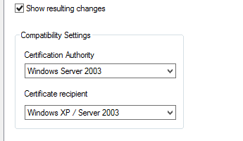

    >[!NOTE]
    MIM CM does not work with certificates based on version 3 certificate templates. You must create a Windows Server® 2003 Enterprise (version 2)certificate template. See the following link for V3 details https://blogs.msdn.microsoft.com/ms-identity-support/2016/07/14/faq-for-fim-2010-to-support-sha2-kspcng-and-v3-certificate-templates-for-issuing-user-and-agent-certificates-and-mim-2016-upgrade

6. In the **Properties of New Template** dialog box, on the **General** tab, in the **Template display name** box, type **MIM CM Signing**. Change the **Validity Period** to **2 years**, and then clear the **Publish certificate in Active Directory** check box.

7. On the **Request Handling** tab, ensure that the **Allow private key to be exported** check box is selected, and then click **Cryptography tab**.

8. In the **Cryptography Selection** dialog box, disable **Microsoft Enhanced Cryptographic Provider v1.0**, enable **Microsoft Enhanced RSA and AES
Cryptographic Provider**, and then click **OK**.

On the **Subject Name** tab, clear the **Include e-mail name in subject name** and **E-mail name** check boxes.

On the **Extensions** tab, in the **Extensions included in this template** list, ensure that **Application Policies** is selected, and then click **Edit**.

In the **Edit Application Policies Extension** dialog box, select both the **Encrypting File System** and the **Secure Email** application policies. Click **Remove**, and then click **OK**.

On the **Security** tab perform the following steps:

- Remove **Administrator**.

- Remove **Domain Admins**.

- Remove **Domain Users**.

- Assign only **Read** and **Write** permissions to **Enterprise Admins**.

- Add **MIMCMAgent.**

- Assign **Read** and **Enroll** permissions to **MIMCMAgent**.

In the **Properties of New Template** dialog box, click **OK**.

Leave the **Certificate Templates Console** open.

#### Create the MIM CM Enrollment Agent certificate template

-   In the **Certificate Templates Console**, in the **details** pane, select and right-click **Enrollment Agent**, and then click **Duplicate Template**.

In the **Duplicate Template** dialog box, select **Windows Server 2003 Enterprise**, and then click **OK**.

In the **Properties of New Template** dialog box, on the **General** tab, in the **Template display name** box, type **MIM CM Enrollment Agent**. Ensure that the **Validity Period** is **2 years**.

On the **Request Handling** tab, enable **Allow private key to be exported**, and then click **CSPs or Cryptography Tab.**

In the **CSP Selection** dialog box, disable **Microsoft Base Cryptographic Provider v1.0**, disable **Microsoft Enhanced Cryptographic Provider v1.0**, enable **Microsoft Enhanced RSA and AES Cryptographic Provider**, and then click **OK**.

On the **Security** tab perform the following:

- Remove **Administrator**.

- Remove **Domain Admins**.

- Assign only **Read** and **Write** permissions to **Enterprise Admins**.

- Add **MIMCMEnrollAgent**.

- Assign **Read** and **Enroll** permissions to **MIMCMEnrollAgent**.

In the **Properties of New Template** dialog box, click **OK**.

Leave the **Certificate Templates Console** open.

#### Create the MIM CM Key Recovery Agent certificate template

1. In the **Certificate Templates** console, in the **details** pane, select and right-click **Key Recovery Agent**, and then click **Duplicate    Template**.

2. In the **Duplicate Template** dialog box, select **Windows Server 2003 Enterprise**, and then click **OK**.

3. In the **Properties of New Template** dialog box, on the **General** tab, in the **Template display name** box, type **MIM CM Key Recovery Agent**. Ensure that the **Validity Period** is **2 years** On the **Cryptography Tab.**

4. In the **Providers Selection** dialog box, disable **Microsoft Enhanced Cryptographic Provider v1.0**, enable **Microsoft Enhanced RSA and AES
Cryptographic Provider**, and then click **OK**.

5. On the **Issuance Requirements** tab, ensure that **CA certificate manager approval** is **disabled**.

6. On the **Security** tab perform the following:

    - Remove **Administrator**.

    - Remove **Domain Admins**.

    - Assign only **Read** and **Write** permissions to **Enterprise Admins**.

    - Add **MIMCMKRAgent**.

    - Assign **Read** and **Enroll** permissions to **KRAgent**.

7. In the **Properties of New Template** dialog box, click **OK**.

8. Close the **Certificate Templates Console**.

#### Publish the required certificate templates at the Certification Authority

1. Restore the **Certification Authority** console.

2. In the **Certification Authority** console, in the console tree, right-click **Certificate Templates**, point to **New**, and then click **Certificate Template to Issue**.
3. In the **Enable Certificate Templates** dialog box, select **MIM CM Enrollment Agent**, **MIM CM Key Recovery Agent**, and **MIM CM Signing**. Click **OK**.
4. In the console tree, click **Certificate Templates**.
5.  Verify that the three new templates appear in the **details** pane, and then close **Certification Authority**.

    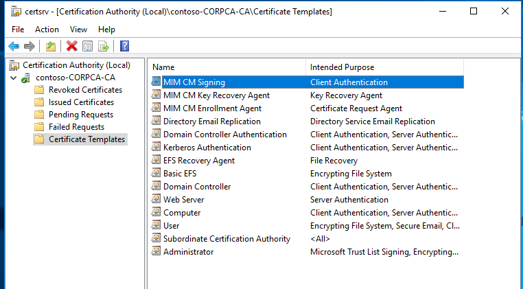

6. Close all open windows and log off.

### IIS configuration 

In order to hoIn order to host the website for CM,stall and configure IIS

#### Install and configure IIS

1. Login to **CORLog in as **MIMINSTALL** account

>[!IMPORTANT]
The MIM installation account should be a local administrator

2. Open powershell and run the following command

   - ```Install-WindowsFeature –ConfigurationFilePath```

>[!NOTE]
 A site named Default Web Site is installed by default with IIS 7. If that site was renamed or removed a site with the name Default Web Site must be available before MIM CM can be installed.

#### Configuring Kerberos

The MIMCMWebAgent account will be running the MIM CM portal. By default in IIS and up kernel mode authentication is used in IIS by default. You will disable Kerberos kernel mode authentication and configure SPNs on the MIMCMWebAgent account instead. Some command will require elevated permission in active directory and CORPCM server.

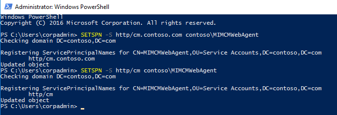

```
#Kerberos settings
#SPN
SETSPN -S http/cm.contoso.com contoso\MIMCMWebAgent
#Delegation for certificate authority
Get-ADUser CONTOSO\MIMCMWebAgent | Set-ADObject -Add @{"msDS-AllowedToDelegateTo"="rpcss/CORPCA","rpcss/CORPCA.contoso.com"}

```

**Updating IIS on **CORPCM**


```
add-pssnapin WebAdministration

Set-WebConfigurationProperty -Filter System.webServer/security/authentication/WindowsAuthentication -Location 'Default Web Site' -Name enabled -Value $true
Set-WebConfigurationProperty -Filter System.webServer/security/authentication/WindowsAuthentication -Location 'Default Web Site' -Name useKernelMode -Value $false
Set-WebConfigurationProperty -Filter System.webServer/security/authentication/WindowsAuthentication -Location 'Default Web Site' -Name useAppPoolCredentials -Value $true

```


>[!NOTE]
You will need to add a DNS A Record for the “cm.contoso.com” and point to CORPCM IP

#### Requiring SSL on the MIM CM portal

It is highly recommended that you require SSL on the MIM CM portal. If you don’t the wizard will even warn you about it.

1. Enroll in web certificate for **cm.contoso.com** assign to default site

2. Open **IIS Manager** and navigate to **Certificate Management**

3. In Features View, double-click SSL Settings.

4. On the SSL Settings page, select **Require SSL**.

5. In the Actions pane, click **Apply.**

### Database Configuration **CORPSQL** For MIM CM

1. Ensure that you are connected to the CORPSQL01 Server.

2. Ensure you are logged on as SQL DBA

3. Run the following T-SQL script to allow the CONTOSO\\MIMINSTALL Account to create the database when we go to the configuration step

>[!NOTE]
We will need to come back to SQL when we are ready for the exit & policy module

```
create login [CONTOSO\\MIMINSTALL] from windows;
exec sp_addsrvrolemember 'CONTOSO\\MIMINSTALL', 'dbcreator';
exec sp_addsrvrolemember 'CONTOSO\\MIMINSTALL', 'securityadmin';  
```

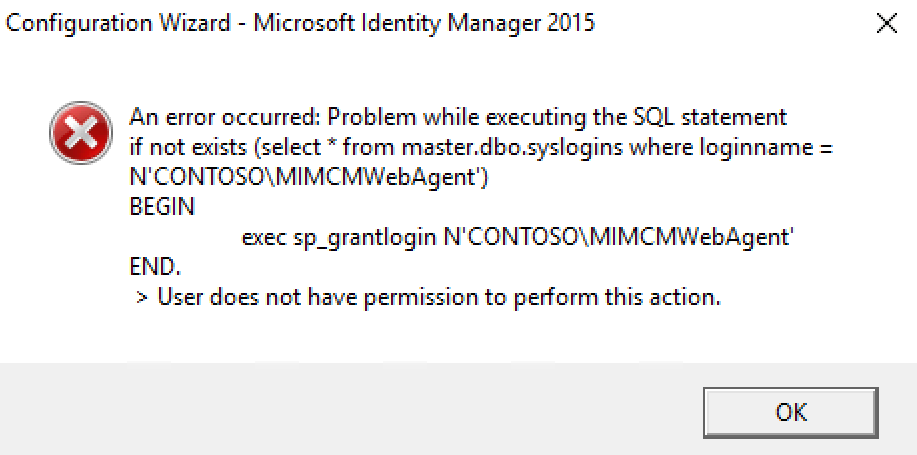

## Deployment of Microsoft Identity Manager 2016 Certificate Management

1. Ensure that you are connected to the CORPCM Server and that the **MIMINSTALL** account is a member of the **local administrators** group.

2. Ensure you are logged on as Contoso\\MIMINSTALL.

3. Mount the Microsoft Identity Manager SP1 ISO.

4. **Open** the **Certificate Management\\x64** directory.

5. In the **x64** window, right-click **Setup**, and then click **Run as administrator**.

6. On the Welcome to the Microsoft Identity Manager Certificate Management Setup Wizard page, click **Next.**

7. On the End-User License Agreement page, read the agreement, enable the I accept the terms in the license agreement **check box**, and then click Next.

8. On the Custom Setup page, make sure the **MIM CM Portal** and **MIM CM Update Service components** are set to be installed, and then **click Next**.

9. On the Virtual Web Folder page, ensure that the Virtual folder name is **CertificateManagement** , and then **click Next**.

10. On the Install Microsoft Identity Manager Certificate Management page, **click Install**.

11. On the **Completed** the Microsoft Identity Manager Certificate Management Setup Wizard page, **click Finish**.

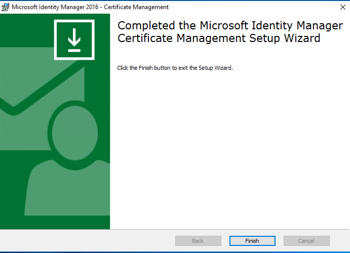

### Configuration Wizard of Microsoft Identity Manager 2016 Certificate Management

Before logging into CORPCM please add MIMINSTALL to **domain Admins, Schema Admins and local administrators** group for configuration wizard . This can
be removed later once configuration is complete.      
    
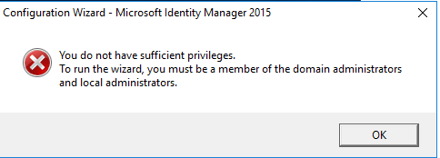

1.   From the **Start** menu, click **Certificate Management Config Wizard**. And Run as **Administrator**

2.   On the **Welcome to the Configuration Wizard** page, click **Next**.

3.   On the **CA Configuration** page, ensure that the selected CA is **Contoso-CORPCA-CA**, ensure that the selected server is     **CORPCA.CONTOSO.COM**, and then click **Next**.

4.  On the **Set up the Microsoft® SQL Server® Database** page, in the **Name of SQL Server** box, type **CORPSQL1** , enable the **Use my credentials to create the database** check box, and then click **Next**.

5. On the **Database Settings** page, accept the default database name of **FIMCertificateManagement**, ensure that **SQL integrated authentication**
    is selected, and then click **Next**.

6. On the **Set up Active Directory** page, accept the default name provided for the service connection point, and then click **Next**.

7. On the **Authentication method** page confirm **windows integrated Authentication** is selected, then click **Next**.

8. On the **Agents – FIM CM** page, clear the **Use the FIM CM default settings** check box, and then click **Custom Accounts**.

9. In the **Agents – FIM CM** multi-tabbed dialog box, on each tab, type the following information:

   - User name: **Update** 
   - Password: **Pass\@word1**
   - Confirm Password: **Pass\@word1**
   - Use an existing user: **Enabled**
>[!NOTE]
We created these accounts earlier. Make sure that the procedures in step 8 are repeated for all six agent account tabs.

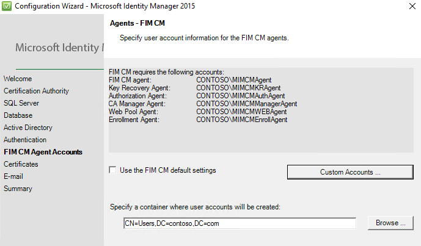

10. When all agent account information is complete, click **OK**.

11. On the **Agents – MIM CM** page, click **Next**.

12. On the **Set up server certificates** page, enable the following certificate templates:

    - Certificate template to be used for the recovery agent Key Recovery Agent certificate: **MIMCMKeyRecoveryAgent**.

    - Certificate template to be used for the FIM CM Agent certificate:
        **MIMCMSigning**.

    - Certificate template to be used for the enrollment agent certificate:
        **FIMCMEnrollmentAgent**.

13. On the **Set-up server certificates** page, click **Next**.

14. On the **Setup E-mail Server, Document Printing** page, in the **Specify the
    name of the SMTP server you want to use to e-mail registration
    notifications** box and then click **Next.**

15. On the **Ready to configure** page, click **Configure**.

16. In the **Configuration Wizard – Microsoft Forefront Identity Manager 2010
    R2** warning dialog box, click **OK** to acknowledge that SSL is not enabled
    on the IIS virtual directory.

    

    >[!NOTE] 
    Do not click the Finish button until the execution of the configuration wizard is complete. Logging for wizard can be found here :**%programfiles%\\Microsoft Forefront Identity Management\\2010\\Certificate Management\\config.log**

17. Click **Finish**.

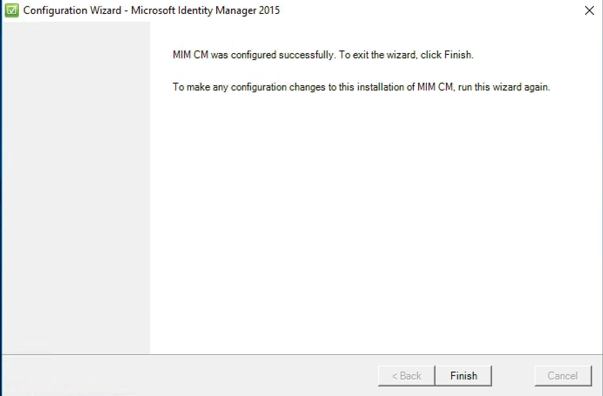

18. Close all open windows.

19. Add https://cm.contoso.com/certificatemanagement to local intranet zone in your browser.

20. Visit site from server CORPCM https://cm.contoso.com/certificatemanagement  

    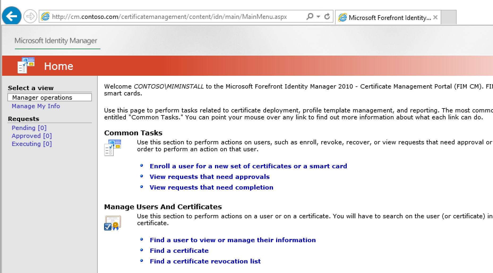

### Verify the CNG Key Isolation Service

1. From **Administrative Tools**, open **Services**.

2. In the **details** pane, double-click **CNG Key Isolation**.

3. On the **General** tab, change the **Startup Type** to **Automatic**.

4. On the **General** tab, start the service if it is not in a started state.

5. On the **General** tab, click **OK**.

### Installing and Configuring the CA Modules :

In this step, we will install and configure the FIM CM CA modules on the certification authority.

1. Configure FIM CM to only inspect user permissions for management operations

2. In the **C:\\Program Files\\Microsoft Forefront Identity Manager\\2010\\Certificate Management\\web** window, make a copy of **web.config** naming the copy **web.1.config**.

3. In the **Web** window, right-click **Web.config**, and then click **Open**.

    >[!Note]
    The Web.config file is opened in notepad

4. When the file opens, press CTRL+F.

5. In the **Find and Replace** dialog box, in the **Find what** box, type **UseUser**, and then click **Find Next** three times.

6. Close the **Find and Replace** dialog box.

7. You should be on the line **\<add key=”Clm.RequestSecurity.Flags” value=”UseUser,UseGroups” /\>**. Change the line to read **\<add key=”Clm.RequestSecurity.Flags” value=”UseUser” /\>**.

8. Close the file, saving all changes.

9. Create an account for the CA computer at the SQL server \<no script\>

10. Ensure that you are connected to the **CORPSQL01** server.

11. Ensure you are logged on as **DBA**

12. From the **Start** menu, launch **SQL Server Management Studio**.

13. In the **Connect to Server** dialog box, in the **Server name** box, type **CORPSQL01,** and then click **Connect**.

14. In the console tree, expand **Security**, and then click **Logins**.

15. Right-click **Logins**, and then click **New Login**.

16. On the **General** page, in the **Login name** box, type **contoso\\CORPCA\$**. Select **Windows Authentication**. Default database
    is **FIMCertificateManagement**.

17. In the left pane, select **User Mapping**. In the right pane, click the check box in the **Map** column beside **FIMCertificateManagement**. In the **database role membership for: FIMCertificateManagement** list, enable the **clmApp** role.

18. Click **OK**.

19. Close **Microsoft SQL Server Management Studio**.

### Install the FIM CM CA modules on the Certification Authority

1. Ensure that you are connected to the **CORPCA** server.

2. In the **X64** windows, right-click **Setup.exe**, and then click **Run as administrator**.

3. On the **Welcome to the Microsoft Identity Manager Certificate Management Setup Wizard** page, click **Next**.

4. On the **End-User License Agreement** page, read the agreement. Select the **I accept the terms in the license agreement** check box, and then click **Next**.

5. On the **Custom Setup** page, select **MIM CM Portal**, and then click **This feature will not be available**.

6. On the **Custom Setup** page, select **MIM CM Update Service**, and then click **This Feature will not be available**.

    >[!Note]
    This will leave the MIM CM CA Files as the only feature enabled for the installation.

7. On the **Custom Setup** page, click **Next**.

8. On the **Install Microsoft Identity Manager Certificate Management** page, click **Install**.

9. On the **Completed the Microsoft Identity Manager Certificate Management Setup Wizard** page, click **Finish**.

10. Close all open windows.

### Configure the MIM CM Exit Module

1. From **Administrative Tools**, open **Certification Authority**.

2. In the console tree, right-click **contoso-CORPCA-CA**, and then click
    **Properties**.

3. On the **Exit Module** tab, select **FIM CM Exit Module**, and then click
    **Properties**.

4. In the **Specify the CM database connection string** box, type **Connect Timeout=15;Persist Security Info=True; Integrated Security=sspi;Initial
    Catalog=FIMCertificateManagement;Data Source=CORPSQL01**. Leave the  **Encrypt the Connection String** check box enabled, and then click **OK**.
5. In the **Microsoft FIM Certificate Management** message box, click **OK**.

6. In the **contoso-CORPCA-CA Properties** dialog box, click **OK**.

7. Right-click **contoso-CORPCA-CA***,* point to **All Tasks**, and then click **Stop Service**. Wait until Active Directory Certificate Services stops.

8. Right-click **contoso-CORPCA-CA***,* point to **All Tasks**, and then click **Start Service**.

9. Minimize the **Certification Authority** console.

10. From **Administrative Tools**, open **Event Viewer**.

11. In the console tree, expand **Application and Services Logs**, and then click **FIM Certificate Management**.

12. In the list of events, verify that the latest events do *not* include any **Warning** or **Error** events since the last restart of Certificate
    Services.

    >[!NOTE] 
    The last event should state that the Exit Module loaded using settings from ```SYSTEM\CurrentControlSet\Services\CertSvc\Configuration\ContosoRootCA\ExitModules\Clm.Exit```

13. Minimize the **Event Viewer**.

### Copy the MIMCMAgent Certificate’s thumbprint to Windows® clipboard

1. Restore the **Certification Authority** console.

2. In the console tree, expand **contoso-CORPCA-CA**, and then click **Issued Certificates**.

3. In the **details** pane, double-click the certificate with **CONTOSO\\MIMCMAgent** in the **Requester Name** column and with **FIM CM Signing** in the **Certificate Template** column.

4. On the **Details** tab, select the **Thumbprint** field.

5. Select the thumbprint, and then press CTRL+C.

    >[!NOTE]
    Do **not** include the leading space in the list of thumbprint characters.

6. In the **Certificate** dialog box, click **OK**.

7. From the **Start** menu, in the **Search programs and files** box, type **Notepad**, and then press ENTER.

8. In **Notepad**, from the **Edit** menu, click **Paste**.

9. From the **Edit** menu, click **Replace**.

10. In the **Find what** box, type a space character, and then click **Replace All**.

    >[!Note]
    This removes all of the spaces between the characters in the thumbprint.
    
11. In the **Replace** dialog box, click **Cancel**.

12. Select the converted *thumbprintstring*, and then press CTRL+C.

13. Close **Notepad** without saving changes.

### Configure the FIM CM Policy Module

1. Restore the **Certification Authority** console.

2. Right-click **contoso-CORPCA-CA**, and then click **Properties**.

3.  In the **contoso-CORPCA-CA Properties** dialog box, on the **Policy Module** tab, click **Properties**.

- On the **General** tab, ensure that **Pass non-FIM CM requests to the
    default policy module for processing** is selected.

- On the **Signing Certificates** tab, click **Add**.

- In the Certificate dialog box, right-click the **Please specify hex-encoded
    certificate hash** box, and then click **Paste**.

- In the **Certificate** dialog box, click **OK**.

    **Note:** If the **OK** button is not enabled, you accidentally included a
    hidden character in the thumbprint string when you copied the thumbprint from
    the clmAgent certificate. Repeat all steps starting from **Task 4: Copy the
    MIMCMAgent Certificate’s Thumbprint to Windows Clipboard** in this exercise.

- In the **Configuration Properties** dialog box, ensure that the thumbprint
    appears in the **Valid Signing Certificates** list, and then click **OK**.

- In the **FIM Certificate Management** message box, click **OK**.

- In the **contoso-CORPCA-CA Properties** dialog box, click **OK**.

- Right-click **contoso-CORPCA-CA***,* point to **All Tasks**, and then click
    **Stop Service**.

- Wait until Active Directory Certificate Services stops.

- Right-click **contoso-CORPCA-CA***,* point to **All Tasks**, and then click
    **Start Service**.

- Close the **Certification Authority** console.

- Close all open windows and then log off.

- **Last step in the deployment** is we want to make sure CONTOSO\\MIMCM-Managers can deploy and create templates and configure the system without being schema and Domain Admins. The next script will ACL the permissions to the certificate templates using dsacls. Please run with account that has full permission to change security Read and Write permissions to each existing certificate template in the forest.

- First Steps: **Configuring Service Connection Point and Target Group Permissions & Delegating Profile Template Management**
  - Configure permissions on the service connection point (SCP).

  - Configure delegated profile template management.

  - Configure permissions on the service connection point (SCP). **\<no script\>**

        -   Ensure that you are connected to the **CORPDC** virtual server.

        -   Log on as **contoso\\corpadmin**

        -   From **Administrative Tools**, open **Active Directory Users and
            Computers**.

        -   In **Active Directory Users and Computers**, on the **View** menu,
            ensure that **Advanced Features** is enabled.

        -   In the console tree, expand **Contoso.com** \| **System** \|
            **Microsoft** \| **Certificate Lifecycle Manager**, and then click
            **CORPCM**.

        -   Right-click **CORPCM**, and then click **Properties**.

        -   In the **CORPCM Properties** dialog box, on the **Security** tab,
            add the following groups with the corresponding permissions:

    | Group          | Permissions                                                                                                                                                         |
    |----------------|---------------------------------------------------------------------------------------------------------------------------------------------------------------------|
    | mimcm-Managers | Read </br> FIM CM Audit</br> FIM CM Enrollment Agent</br> FIM CM Request Enroll</br> FIM CM Request Recover</br> FIM CM Request Renew</br> FIM CM Request Revoke </br> FIM CM Request Unblock Smart Card |
    | mimcm-HelpDesk | Read</br> FIM CM Enrollment Agent</br> FIM CM Request Revoke</br> FIM CM Request Unblock Smart Card                                                                                |
- In the **CORPDC Properties** dialog box, click **OK**.

- Leave **Active Directory Users and Computers** open.

- **Configure permissions on the descendant user objects**
    - Ensure that you are still in the **Active Directory Users and Computers** console.
    - In the console tree, right-click **Contoso.com**, and then click **Properties**.
    - On the **Security** tab, click **Advanced**.
    - In the **Advanced Security Settings for Contoso** dialog box, click **Add**.
    - In the **Select User, Computer, Service Account, or Group** dialog box, in the **Enter the object name to select** box, type **mimcm-Managers**, and then click **OK**.
    - In the **Permission Entry for Contoso** dialog box, in the **Apply to** list, select **Descendant User objects** and then enable the **Allow** check box for the following **Permissions**:
        - **Read all properties**
        - **Read permissions**
        - **FIM CM Audit**
        - **FIM CM Enrollment Agent**
        - **FIM CM Request Enroll**
        - **FIM CM Request Recover**
        - **FIM CM Request Renew**
        - **FIM CM Request Revoke**
        - **FIM CM Request Unblock Smart Card**
    - In the **Permission Entry for Contoso** dialog box, click **OK**.
    - In the **Advanced Security Settings for Contoso** dialog box, click **Add**.
    - In the **Select User, Computer, Service Account, or Group** dialog box, in the **Enter the object name to select** box, type **mimcm-HelpDesk**, and then click **OK**.
    - In the **Permission Entry for Contoso** dialog box, in the **Apply to** list, select **Descendant User objects** and then select the **Allow**
        check box for the following **Permissions**:
            - **Read all properties**
            - **Read permissions**
            - **FIM CM Enrollment Agent**
            - **FIM CM Request Revoke**
            - **FIM CM Request Unblock Smart Card**
    - In the **Permission Entry for Contoso** dialog box, click **OK**.
    -In the **Advanced Security Settings for Contoso** dialog box, click **OK**.
    - In the **contoso.com Properties** dialog box, click **OK**.
    - Leave **Active Directory Users and Computers** open.

    - **Configure permissions on the descendant user objects \<no script\>**
        - Ensure that you are still in the **Active Directory Users and Computers** console.
        - In the console tree, right-click **Contoso.com**, and then click **Properties**.
        - On the **Security** tab, click **Advanced**.
        - In the **Advanced Security Settings for Contoso** dialog box, click **Add**.
        - In the **Select User, Computer, Service Account, or Group** dialog box, in the **Enter the object name to select** box, type **mimcm-Managers**, and then click **OK**.
        - In the **Permission Entry for CONTOSO** dialog box, in the **Apply to** list, select **Descendant User objects** and then enable the
            **Allow** check box for the following **Permissions**:
            - **Read all properties**
            - **Read permissions**
            - **FIM CM Audit**
            - **FIM CM Enrollment Agent**
            - **FIM CM Request Enroll**
            - **FIM CM Request Recover**
            - **FIM CM Request Renew**
            - **FIM CM Request Revoke**
            - **FIM CM Request Unblock Smart Card**
    - In the **Permission Entry for CONTOSO** dialog box, click **OK**.
    - In the **Advanced Security Settings for CONTOSO** dialog box, click **Add**.
    - In the **Select User, Computer, Service Account, or Group** dialog box, in the **Enter the object name to select** box, type **mimcm-HelpDesk**, and then click **OK**.
    - In the **Permission Entry for CONTOSO** dialog box, in the **Apply to** list, select **Descendant User objects** and then select the **Allow** check box for the following **Permissions**:
            - **Read all properties**
            - **Read permissions**
            - **FIM CM Enrollment Agent**
            - **FIM CM Request Revoke**
            - **FIM CM Request Unblock Smart Card**
    - In the **Permission Entry for contoso** dialog box, click **OK**.
    - In the **Advanced Security Settings for Contoso** dialog box, click **OK**.
    - In the **contoso.com Properties** dialog box, click **OK**.
    - Leave **Active Directory Users and Computers** open.
- Second Steps: **Delegating Certificate Template Management Permissions \<script\>**
    - Delegating permissions on the Certificate Templates container.
    - Delegating permissions on the OID container.
    - Delegating permissions on the existing certificate templates.
- Define permissions on the Certificate Templates container
     1. Restore the **Active Directory Sites and Services** console.
     2. In the console tree, expand **Services**, expand **Public Key Services**, and then click **Certificate Templates**.
     3. In the console tree, right-click **Certificate Templates**, and then click **Delegate Control**.
     4. In the **Delegation of Control** Wizard, click **Next**.
     5. On the **Users or Groups** page, click **Add**.
     6. In the **Select Users, Computers, or Groups** dialog box, in the **Enter the object names to select** box, type **mimcm-Managers**, and then click
            **OK**.
     7. On the **Users or Groups** page, click **Next**.
     8. On the **Tasks to Delegate** page, click **Create a custom task to delegate**, and then click **Next**.
     9.  On the **Active Directory Object Type** page, ensure that **This folder, existing objects in this folder, and creation of new objects in this            folder** is selected, and then click **Next**.
     10. On the **Permissions** page, in the **Permissions** list, select the **Full Control** check box, and then click **Next**.
     11. On the **Completing the Delegation of Control Wizard** page, click **Finish**.

- Define permissions on the OID container
     1. In the console tree, right-click **OID**, and then click **Properties**.
     2. In the **OID Properties** dialog box, on the **Security** tab, click **Advanced**.
     3. In the **Advanced Security Settings for OID** dialog box, click **Add**.
     4. In the **Select User, Computer, Service Account, or Group** dialog box, in the **Enter the object name to select** box, type **mimcm-Managers**, and then click **OK**.
     5. In the **Permissions Entry for OID** dialog box, ensure that the permissions apply to **This object and all descendant objects**, click **Full Control**, and then click **OK**.
     6. In the **Advanced Security Settings for OID** dialog box, click **OK**.
     7. In the **OID Properties** dialog box, click **OK**.
     8. Close **Active Directory Sites and Services**.

**Scripts: Permissions on the OID, Profile Template & Certificate Templates container**

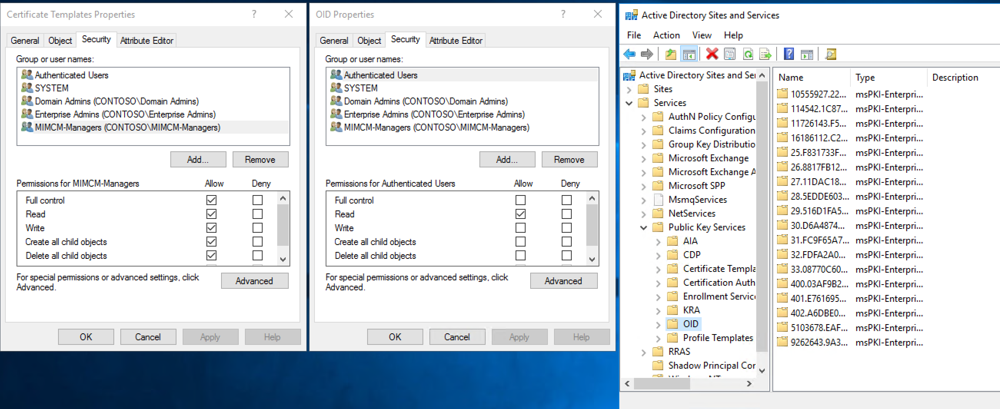

```import-module activedirectory
$adace = @{
"OID" = "AD:\\CN=OID,CN=Public Key Services,CN=Services,CN=Configuration,DC=contoso,DC=com";
"CT" = "AD:\\CN=Certificate Templates,CN=Public Key
Services,CN=Services,CN=Configuration,DC=contoso,DC=com";
"PT" = "AD:\\CN=Profile Templates,CN=Public Key
Services,CN=Services,CN=Configuration,DC=contoso,DC=com"
}
$adace.GetEnumerator() | **Foreach-Object** {
$acl = **Get-Acl** *-Path* $_.Value
$sid=(**Get-ADGroup** "MIMCM-Managers").SID
$p = **New-Object** System.Security.Principal.SecurityIdentifier($sid)
##https://msdn.microsoft.com/en-us/library/system.directoryservices.activedirectorysecurityinheritance(v=vs.110).aspx
$ace = **New-Object** System.DirectoryServices.ActiveDirectoryAccessRule
($p,[System.DirectoryServices.ActiveDirectoryRights]"GenericAll",[System.Security.AccessControl.AccessControlType]::Allow,
[DirectoryServices.ActiveDirectorySecurityInheritance]::All)
$acl.AddAccessRule($ace)
**Set-Acl** *-Path* $_.Value *-AclObject* $acl
}
```

**Scripts: Delegating permissions on the existing certificate templates.**

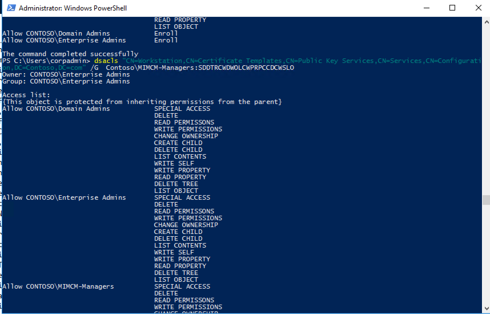

dsacls "CN=Administrator,CN=Certificate Templates,CN=Public Key
Services,CN=Services,CN=Configuration,DC=Contoso,DC=com" /G
Contoso\\MIMCM-Managers:SDDTRCWDWOLCWPRPCCDCWSLO

dsacls "CN=CA,CN=Certificate Templates,CN=Public Key
Services,CN=Services,CN=Configuration,DC=Contoso,DC=com" /G
Contoso\\MIMCM-Managers:SDDTRCWDWOLCWPRPCCDCWSLO

dsacls "CN=CAExchange,CN=Certificate Templates,CN=Public Key
Services,CN=Services,CN=Configuration,DC=Contoso,DC=com" /G
Contoso\\MIMCM-Managers:SDDTRCWDWOLCWPRPCCDCWSLO

dsacls "CN=CEPEncryption,CN=Certificate Templates,CN=Public Key
Services,CN=Services,CN=Configuration,DC=Contoso,DC=com" /G
Contoso\\MIMCM-Managers:SDDTRCWDWOLCWPRPCCDCWSLO

dsacls "CN=ClientAuth,CN=Certificate Templates,CN=Public Key
Services,CN=Services,CN=Configuration,DC=Contoso,DC=com" /G
Contoso\\MIMCM-Managers:SDDTRCWDWOLCWPRPCCDCWSLO

dsacls "CN=CodeSigning,CN=Certificate Templates,CN=Public Key
Services,CN=Services,CN=Configuration,DC=Contoso,DC=com" /G
Contoso\\MIMCM-Managers:SDDTRCWDWOLCWPRPCCDCWSLO

dsacls "CN=CrossCA,CN=Certificate Templates,CN=Public Key
Services,CN=Services,CN=Configuration,DC=Contoso,DC=com" /G
Contoso\\MIMCM-Managers:SDDTRCWDWOLCWPRPCCDCWSLO

dsacls "CN=CTLSigning,CN=Certificate Templates,CN=Public Key
Services,CN=Services,CN=Configuration,DC=Contoso,DC=com" /G
Contoso\\MIMCM-Managers:SDDTRCWDWOLCWPRPCCDCWSLO

dsacls "CN=DirectoryEmailReplication,CN=Certificate Templates,CN=Public Key
Services,CN=Services,CN=Configuration,DC=Contoso,DC=com" /G
Contoso\\MIMCM-Managers:SDDTRCWDWOLCWPRPCCDCWSLO

dsacls "CN=DomainController,CN=Certificate Templates,CN=Public Key
Services,CN=Services,CN=Configuration,DC=Contoso,DC=com" /G
Contoso\\MIMCM-Managers:SDDTRCWDWOLCWPRPCCDCWSLO

dsacls "CN=DomainControllerAuthentication,CN=Certificate Templates,CN=Public Key
Services,CN=Services,CN=Configuration,DC=Contoso,DC=com" /G
Contoso\\MIMCM-Managers:SDDTRCWDWOLCWPRPCCDCWSLO

dsacls "CN=EFS,CN=Certificate Templates,CN=Public Key
Services,CN=Services,CN=Configuration,DC=Contoso,DC=com" /G
Contoso\\MIMCM-Managers:SDDTRCWDWOLCWPRPCCDCWSLO

dsacls "CN=EFSRecovery,CN=Certificate Templates,CN=Public Key
Services,CN=Services,CN=Configuration,DC=Contoso,DC=com" /G
Contoso\\MIMCM-Managers:SDDTRCWDWOLCWPRPCCDCWSLO

dsacls "CN=EnrollmentAgent,CN=Certificate Templates,CN=Public Key
Services,CN=Services,CN=Configuration,DC=Contoso,DC=com" /G
Contoso\\MIMCM-Managers:SDDTRCWDWOLCWPRPCCDCWSLO

dsacls "CN=EnrollmentAgentOffline,CN=Certificate Templates,CN=Public Key
Services,CN=Services,CN=Configuration,DC=Contoso,DC=com" /G
Contoso\\MIMCM-Managers:SDDTRCWDWOLCWPRPCCDCWSLO

dsacls "CN=ExchangeUser,CN=Certificate Templates,CN=Public Key
Services,CN=Services,CN=Configuration,DC=Contoso,DC=com" /G
Contoso\\MIMCM-Managers:SDDTRCWDWOLCWPRPCCDCWSLO

dsacls "CN=ExchangeUserSignature,CN=Certificate Templates,CN=Public Key
Services,CN=Services,CN=Configuration,DC=Contoso,DC=com" /G
Contoso\\MIMCM-Managers:SDDTRCWDWOLCWPRPCCDCWSLO

dsacls "CN=FIMCMSigning,CN=Certificate Templates,CN=Public Key
Services,CN=Services,CN=Configuration,DC=Contoso,DC=com" /G
Contoso\\MIMCM-Managers:SDDTRCWDWOLCWPRPCCDCWSLO

dsacls "CN=FIMCMEnrollmentAgent,CN=Certificate Templates,CN=Public Key
Services,CN=Services,CN=Configuration,DC=Contoso,DC=com" /G
Contoso\\MIMCM-Managers:SDDTRCWDWOLCWPRPCCDCWSLO

dsacls "CN=FIMCMKeyRecoveryAgent,CN=Certificate Templates,CN=Public Key
Services,CN=Services,CN=Configuration,DC=Contoso,DC=com" /G
Contoso\\MIMCM-Managers:SDDTRCWDWOLCWPRPCCDCWSLO

dsacls "CN=IPSecIntermediateOffline,CN=Certificate Templates,CN=Public Key
Services,CN=Services,CN=Configuration,DC=Contoso,DC=com" /G
Contoso\\MIMCM-Managers:SDDTRCWDWOLCWPRPCCDCWSLO

dsacls "CN=IPSecIntermediateOnline,CN=Certificate Templates,CN=Public Key
Services,CN=Services,CN=Configuration,DC=Contoso,DC=com" /G
Contoso\\MIMCM-Managers:SDDTRCWDWOLCWPRPCCDCWSLO

dsacls "CN=KerberosAuthentication,CN=Certificate Templates,CN=Public Key
Services,CN=Services,CN=Configuration,DC=Contoso,DC=com" /G
Contoso\\MIMCM-Managers:SDDTRCWDWOLCWPRPCCDCWSLO

dsacls "CN=KeyRecoveryAgent,CN=Certificate Templates,CN=Public Key
Services,CN=Services,CN=Configuration,DC=Contoso,DC=com" /G
Contoso\\MIMCM-Managers:SDDTRCWDWOLCWPRPCCDCWSLO

dsacls "CN=Machine,CN=Certificate Templates,CN=Public Key
Services,CN=Services,CN=Configuration,DC=Contoso,DC=com" /G
Contoso\\MIMCM-Managers:SDDTRCWDWOLCWPRPCCDCWSLO

dsacls "CN=MachineEnrollmentAgent,CN=Certificate Templates,CN=Public Key
Services,CN=Services,CN=Configuration,DC=Contoso,DC=com" /G
Contoso\\MIMCM-Managers:SDDTRCWDWOLCWPRPCCDCWSLO

dsacls "CN=OCSPResponseSigning,CN=Certificate Templates,CN=Public Key
Services,CN=Services,CN=Configuration,DC=Contoso,DC=com" /G
Contoso\\MIMCM-Managers:SDDTRCWDWOLCWPRPCCDCWSLO

dsacls "CN=OfflineRouter,CN=Certificate Templates,CN=Public Key
Services,CN=Services,CN=Configuration,DC=Contoso,DC=com" /G
Contoso\\MIMCM-Managers:SDDTRCWDWOLCWPRPCCDCWSLO

dsacls "CN=RASAndIASServer,CN=Certificate Templates,CN=Public Key
Services,CN=Services,CN=Configuration,DC=Contoso,DC=com" /G
Contoso\\MIMCM-Managers:SDDTRCWDWOLCWPRPCCDCWSLO

dsacls "CN=SmartCardLogon,CN=Certificate Templates,CN=Public Key
Services,CN=Services,CN=Configuration,DC=Contoso,DC=com" /G
Contoso\\MIMCM-Managers:SDDTRCWDWOLCWPRPCCDCWSLO

dsacls "CN=SmartCardUser,CN=Certificate Templates,CN=Public Key
Services,CN=Services,CN=Configuration,DC=Contoso,DC=com" /G
Contoso\\MIMCM-Managers:SDDTRCWDWOLCWPRPCCDCWSLO

dsacls "CN=SubCA,CN=Certificate Templates,CN=Public Key
Services,CN=Services,CN=Configuration,DC=Contoso,DC=com" /G
Contoso\\MIMCM-Managers:SDDTRCWDWOLCWPRPCCDCWSLO

dsacls "CN=User,CN=Certificate Templates,CN=Public Key
Services,CN=Services,CN=Configuration,DC=Contoso,DC=com" /G
Contoso\\MIMCM-Managers:SDDTRCWDWOLCWPRPCCDCWSLO

dsacls "CN=UserSignature,CN=Certificate Templates,CN=Public Key
Services,CN=Services,CN=Configuration,DC=Contoso,DC=com" /G
Contoso\\MIMCM-Managers:SDDTRCWDWOLCWPRPCCDCWSLO

dsacls "CN=WebServer,CN=Certificate Templates,CN=Public Key
Services,CN=Services,CN=Configuration,DC=Contoso,DC=com" /G
Contoso\\MIMCM-Managers:SDDTRCWDWOLCWPRPCCDCWSLO

dsacls "CN=Workstation,CN=Certificate Templates,CN=Public Key
Services,CN=Services,CN=Configuration,DC=Contoso,DC=com" /G
Contoso\\MIMCM-Managers:SDDTRCWDWOLCWPRPCCDCWSLO
