---
# required metadata

title: Web Service Connector Workflow Guide for SOAP | Microsoft Docs
description: This article describes how to create a new project for your data source in Web Service Configuration Tool
keywords:
author: barclayn
ms.author: barclayn
manager: mbaldwin
ms.date: 11/27/2017
ms.topic: get-started-article
ms.service: microsoft-identity-manager
ms.technology: security
ms.assetid: 
---

# Web Service Connector Workflow Guide for SOAP

This article describes how to create a new project for your data source in the Web Service Configuration Tool. Follow below described steps to create a project.

1.  Open Web Service Configuration Tool. It opens a blank project.

2.  Click on *SOAP Project* and then click *Add* button.

3.  Clicking Add button opens below screen. Here, you must provide the information below and then click **Next**:
    - The new web service name
    - Address i.e. WSDL path (which will retrieve the exposed  services, end-points and operations),
    - Namespace 
    - Security Mode i.e. authentication type. 
  
4.  Clicking next opens below screen. Credential screen is being shown as *Basic* security mode was selected in previous screen. In case of ‘None’ mode no such screen would be appeared. Click **Next**.

5.  The WSDL path is being accessed to retrieve the service information and the list of exposed functions is displayed. If the WSDL path entered is incorrect then the configuration tool fails to retrieve the service information and throws error.

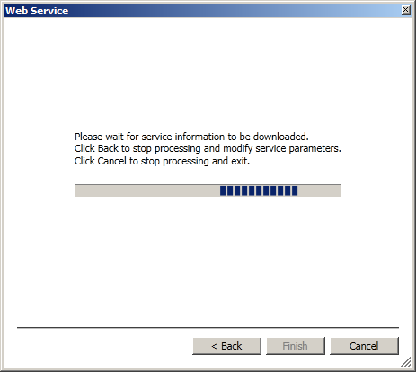

6.  Once the discovery is performed, then it lists the endpoint and the operations that are discovered. Click Finish button.

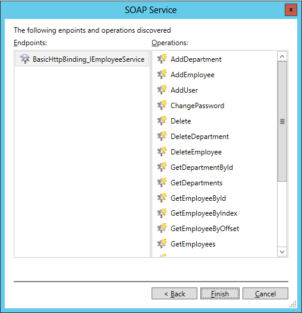

7.  When Finish button is pressed, compilation is performed. Compilation is a process of compiling the data contract assembly, which may be a time consuming operation. User will be informed about compilation errors if there will be any. After the discovery is performed, the tool displays the below screen.

8.  Expanding **SOAP project** and selecting exposed endpoint provided below screen. This screen lists the operations that are declared under the endpoint.

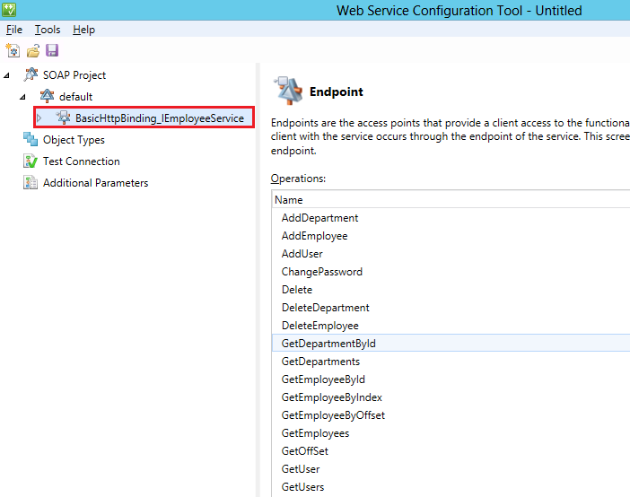

9.  Expanding endpoint displays list of operations. An operation is a function declared by an Endpoint. Each operation addresses a type of task that can be performed within the service. This screen lists the arguments that are declared for the operation. These arguments are then defined when the operation is used in configuring the workflows.

10.  Next step is to define the connector space schema, which is achieved by creating the Object Type and defining their object types. Click **Object Types** in left pane and click **Add** button. Doing this opens below screen. Add a new object type and provide a name. Click the **OK** button.

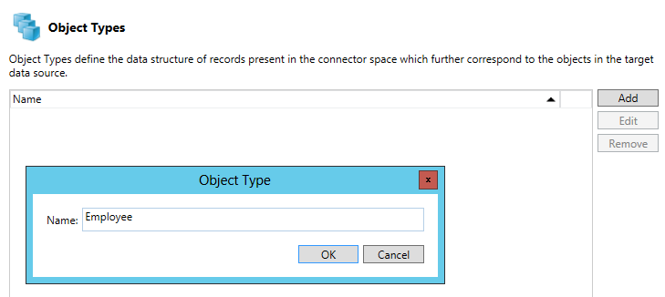

11.  Adding an object type provides below screen.

12.  The right pane corresponding to object type allows you to maintain the attributes and their properties for the selected object type. Clicking Add button provides below screen where one can add attributes.

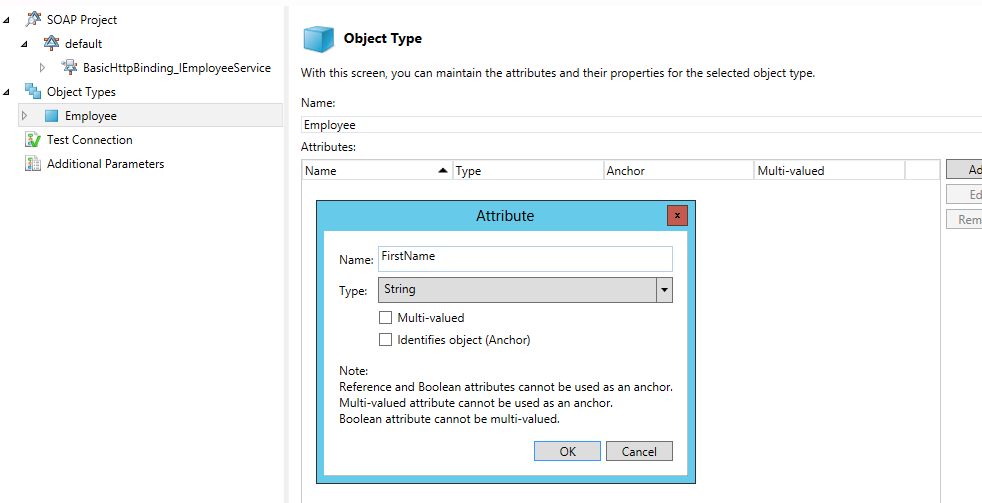

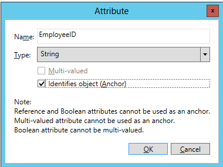

13.  Below screen appears after adding all required attributes.

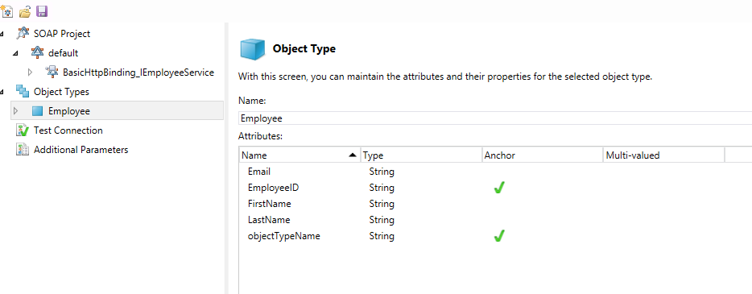

14.  Object type and attributes once created, provides blank workflows that cater to the operations performed in Microsoft Identity Manager 2016 (MIM).

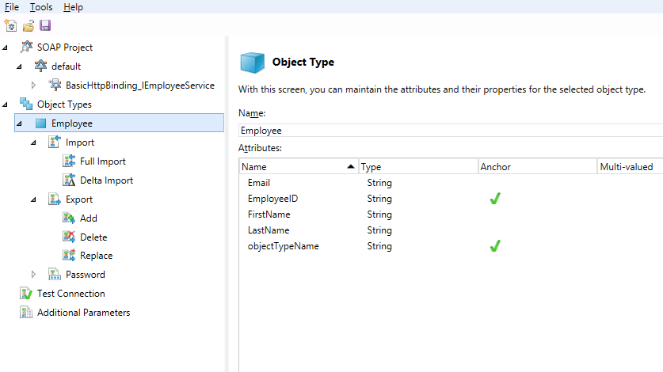

## Configuring Work Flow in Config Tool

The next step is to configure the workflows for your object type. Workflow files are a series of activities that are used by the Web Services Connector at run time in order to implement an appropriate MIM operation. The Web Service configuration Tool helps you to create four different workflows:

-   Import: This operation includes two types of workflows too import data from
    data source.

    -   Full Import – Can be configured

    -   Delta Import – Not supported by Configuration Tool.

-   Export: This operation involves the exporting of data from MIM to connected
    data source. It supports below three types of operations. You can configure
    them as per your requirement.

    -   Add

    -   Delete

    -   Replace

-   Password: To perform password management for the user (object type)

    -   Set password

    -   Change Password

-   Test Connection: Test connection workflow allows you to configure a workflow to check if the connection with data source server is successfully established.

>[!NOTE]
You can configure these workflows for your project or download the default project from the [Microsoft Download Center](http://www.microsoft.com/download/details.aspx?id=29944).

1.  The workflow designer opens the work area to configure the workflow as per requirement. For every object type (new /existing), the configuration tool provides the nodes for workflows that are supported by the tool. 

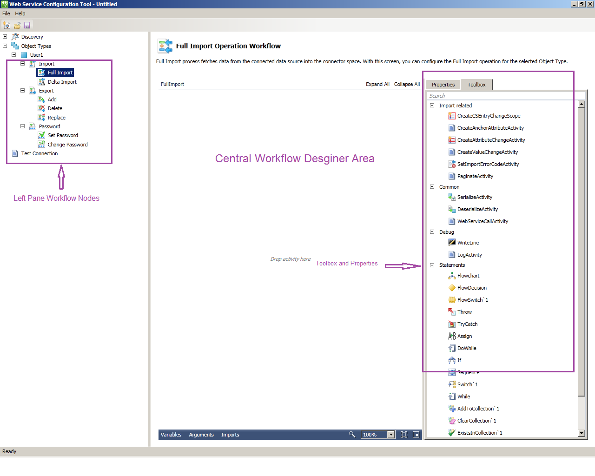

-   **Nodes in left pane**: These help you to select which you want to design which workflow.
-   **Central Workflow Designer**: Here you can drop the activities for configuring the workflows. To accomplish various MIM operations (Export, Import, Password management), you can use the standard and custom workflow activities of .Net workflow Framework 4. The Web Service Configuration tool uses standard and custom workflow activities. For more information on Standard activities, see Using Activity Designers.
-  **Toolbox**: Packages all the tools including system and custom activities and predefined statements to design the workflow. For more details on system toolbox, see
    [Toolbox](http://msdn.microsoft.com/library/aa480213.aspx).
- **Description** This section refers to the header of Toolbox. One tab accesses toolbox and the other properties of the selected individual workflow activity.                                                                                                     |
-   **Properties**: The properties tab displays the properties of a particular workflow activity that is dropped in the designer area and selected. The figure on the left shows the properties of **Assign** activity.

For every activity, the properties will differ and are used while configuring the custom workflow. This tab allows you to define the attributes of the selected tool that has been dropped into the central workflow designer. For more details, see [Properties](http://msdn.microsoft.com/library/ee342461.aspx).

-   **Task Bar:** The task bar includes three elements; **Variables, Arguments and Imports** used together with workflow activities**.** For more details on these, see [A Developer's Introduction to Windows Workflow Foundation (WF) in .NET 4](http://msdn.microsoft.com/library/ee342461.aspx).

The Red circle with exclamation mark [] beside any activity in central designer implies that the operation dropped is not defined correctly and completely. Hover over the red circle to find out the exact error. Once the activity is defined correctly, the red circle changes to yellow information mark automatically.
The Yellow triangle information mark [] beside any activity in central designer implies that the activity is defined but there is more that you can do to complete the activity. Hover cursor over the yellow triangle to see more information.

## Configuring Full Import Work Flow in Config Tool

>[!WARNING]
This is only a sample to create workflow so modification as per API’s custom logic will be required.

1.  Click on the Full Import workflow to configure. **Arguments and Imports are already defined and are specific to the activities.** See the screens below for reference.

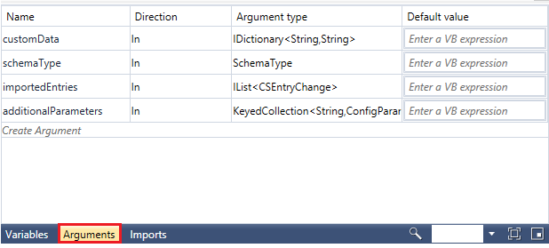

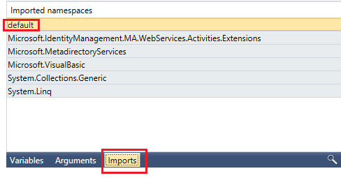

After the reconfiguration of the calls we need to change the names of the attributes that change, add or change the namespace to variables that refer to the return structure of the API and object types that refers to the old namespace. The toolbox in right pane holds all the custom workflow specific activities that you require for configuration. Assign the values to the variables that you are going to use for your logic. Go to the bottom section of central workflow designer and declare the variables. In next step variables will be declared.

2.  Add a Sequence activity: drag the **Sequence** activity designer from the **Toolbox** and drop it on to the Windows Workflow Designer surface. Refer to the screens below.

*The* [Sequence](https://msdn.microsoft.com/en-us/library/system.activities.statements.sequence.aspx) *activity contains an ordered collection of child activities that it executes in order.*

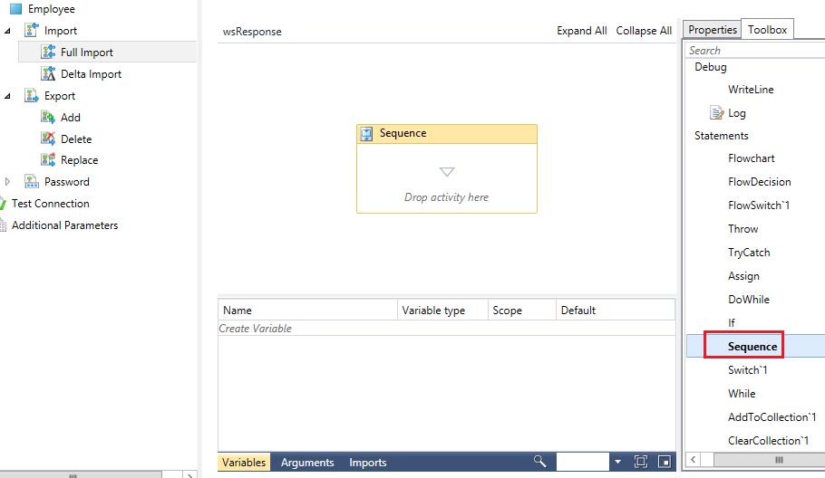

3.  To add a variable locate ‘Create Variable’. Type ‘wsResponse’ for *Name*, lick on *Variable type* dropdown and select ‘Browse for Types’. Clicking  this will open a popup. Select generated--\>default--\>Response. Keep ‘Scope’ and ‘Default’ values unselected. Alternatively we can set these values at Properties box from right hand side pane.

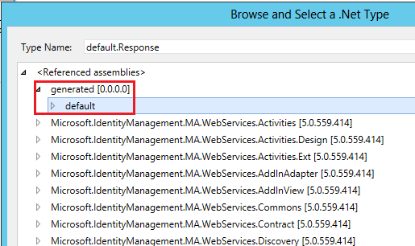

4.  Now add all other variables and below is the final screen.

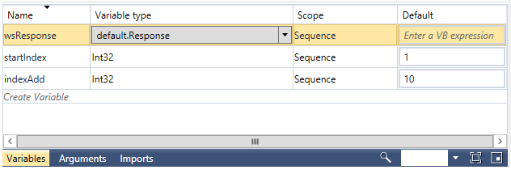

5.  Drag one more **Sequence** activity designer from the **Toolbox** within already added Sequence activity.

6.  Drag a **WebServiceCallActivity** presented under **Common.** This activity is used to invoke Web service operation available after Discovery. This is a custom activity and is very common in different operation scenarios. 

To use this activity you must provide/set following properties:-

-  **Service Name**: - Pick a Web service name which you would like to call.

-  **Endpoint Name**: - Pick an end point name of selected service.

-  **Operation Name**: - Pick the respective operation of service.

-  **Argument**: - On clicking () it will open arguments dialog from there you can assign argument values. Example screen shot –

You should not change neither argument name nor direction nor argument type. If you accidentally changed any of them, the activity would become invalid. Only the *Value* column needs to set here. Like here ‘*wsResponse’* which is a variable of type *Response* is being set here.

1.  Add a **ForEach** activity just below **WebServiceCallActivity.** This activity will be used to iterate over all attributes (both anchors and non-anchors) of object type. While dragging this activity into your workflow designer surface it will automatically enumerate all attribute names of your object. Set required values as per below screen.

2.  Drag a **CreateCSEntryChangeScope** activity within **foreach** body. This activity is used to create an instance of CSEntryChange object in workflow domain for each respective record while retrieving data from target data source. Dragging this activity provides below screen. **CreateAnchorAttribute** activities are automatically inherited.

3.  Set DN expression as **‘string.Concat ("Employee",item.EmployeeID)’**, AnchorValue for EmployeeID: **‘Convert.tostring(item.EmployeeID)’** and for ObjectTypeName as **Employee** Screen after modification looks like below:

>[!NOTE]
Anchor values and object names would be varied as per the exposed web service. This is an example.

4.  Drag a **CreateAttributeChange** activities below the **CreateAnchorAttribute** activity. Number of activities to be dragged would be equal to the number of non-anchor attributes. See below for reference.

5.  Drag **CreateValueChangeActivity** within **CreateAttributeChange** activity and set attribute value as per below screen.

**Note**: To use this activity you only need to pick and assign the respective field from drop down and then assign some value. For multivalued attributes, you can drop multiple *CreateValueChangeActivity* inside *CreateAttributeChangeActivity* activity.

1.  If we want to add some condition against an attribute then **If** activity could be added. Refer below screen for example.

2.  Finally add an **Assign** activity and set expression. Refer below screen.

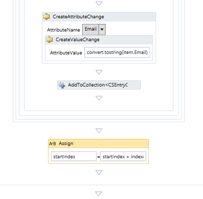

3.  Save this project at the location: `%FIM_INSTALL_FOLDER%\Synchronization Service\Extensions`.

Default projects should be downloaded and saved at the following location on the target system in order to be visible in the web service connector wizard:

`%FIM_INSTALL_DIR\\2010\Synchronization Service\Extensions`

While running the executable file, it prompts to specify the location for installation; you must specify the above location.

>[!IMPORTAT]
Project file can be saved and opened from any location (with the appropriate access privileges of its executor); however, only project files that are saved to `Synchronization Service\Extension` folder will be able to get selected in the Web Service connector wizard accessed through MIM Sync UI.

The user running the Web Service Configuration tool will require the following privileges:

- Full Control to the Synchronization Service Extension folder.
- Read access to the registry key `HKLM\System\CurrentControlSet\Services\FIMSynchronizationService\Parameters` through which, Extension folder path is located.

## Configuring Export Work Flows in Config Tool

### Configuring Export Work Flow in Config Tool (Add operation):

1.  Click on the Export workflow to configure. Click on **Add** under Export. **Arguments and Imports are already defined and are specific to the activities.** See below screens for reference.

2.  Add a Sequence activity: drag the **Sequence** activity designer from the **Toolbox** and drop it on to the Windows Workflow Designer surface. The [Sequence](https://msdn.microsoft.com/en-us/library/system.activities.statements.sequence.aspx) activity contains an ordered collection of child activities that it executes in order.* Click on *Create Variable* link and Assign the values to the variables that you are going to use for your logic.

>[!NOTE]
How to add a variable is already described in detail above in Full Import workflow creation.

3.  Drag a foreach activity within already added Sequence activity to iterate over anchor attribute values.

4.  Click on **properties** and set *Values* field as per below screen. Here **objectToExport** is argument.

5.  Set **DisplayName** as **ForEach\<AnchorAttribute\>**

6.  Set `TypeArgument` as `Microsoft.MetadirectoryServices.AnchorAttribute`.

7.  Add a **switch** activity within **ForEach** body of AnchorAttribute.

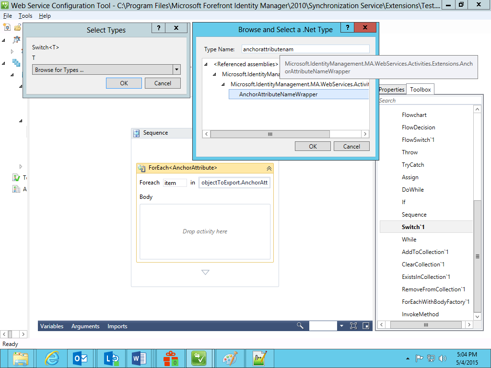

8.  Add an expression as per below screen.

9.  Click on ‘**Add a new case’** and type ‘**EmployeeId’** field. Drag a `Sequence` activity and within it add an `Assign` activity.

10.  Assign ‘**To’** and ‘**Value’** properties for **Assign** activity.

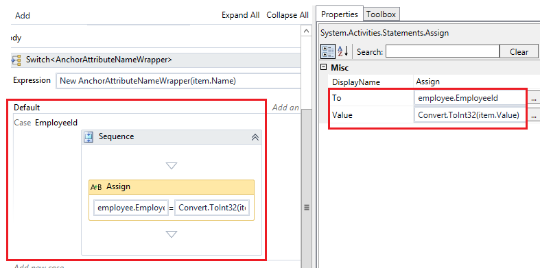

11.  Above forEach activity is used for anchor values. Add another `ForEach` activity to assign values for non-anchor values. Here `AttributeChange` is being used.

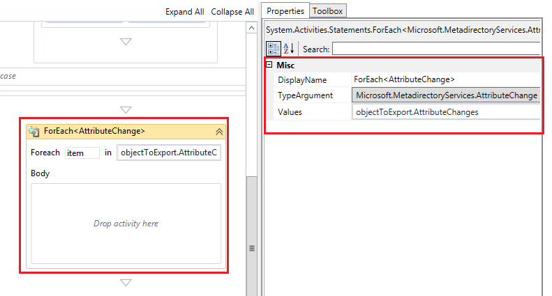

12.  Add a **switch** activity within `ForEach` body of `AttributeChange`.   

13.  Add an expression as per below screen.

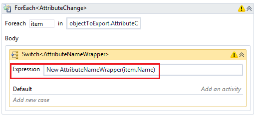

14.  Click on ‘**Add a new case’** and type ‘**FirstName** field. Drag a `Sequence` activity and within it add an `Assign` activity. Assign `To` and `Value` properties for `Assign` activity.

15.  Similarly add all require attributes like LastName, Email etc. 

16.  Drag a **WebServiceCallActivity** and set **Values** for its **Arguments.**

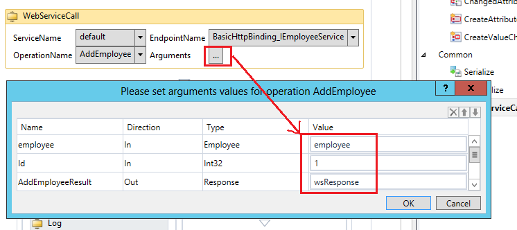

Do not change the argument name or direction nor the argument type. If you accidentally changed any of them, the activity will become invalid. Only the *Value* column needs to set here. Like here **wsResponse** which is a variable of type **Response** is being set here and `employee` of type `Employee`.

17.  Finally add an **If** activity to check response return from web service operation. This is the end of Export-Add workflow creation. Refer below.

Save this project at the location: `%FIM_INSTALL_FOLDER%\Synchronization Service\Extensions`.

### Configuring Export Work Flow in Config Tool (Delete operation):

1.  Click on the Export workflow to configure. Click on **Delete** under Export. **Arguments and Imports are already defined and are specific to the activities.** See below screens for reference.

2.  Add a Sequence activity and Click on *Create Variable* link and Assign the values to the variables that you are going to use for your logic. ‘How to add a variable’ is already described in detail above in Full Import workflow creation.

3.  Drag a **forEach** activity within already added Sequence activity to iterate over anchor attribute values.

4.  Click on **properties** and set *Values* field as per below screen. Here **objectToExport** is argument.

5.  Set `DisplayName` as `ForEach\<AnchorAttribute\>`

6.  Set `TypeArgument` as `Microsoft.MetadirectoryServices.AnchorAttribute`. 

7.  Add a `switch` activity within `ForEach` body of AnchorAttribute. 

8.  Add an expression as per below screen.

9.  Click on ‘**Add a new case’** and type ‘**EmployeeId’** field. Drag a `Sequence` activity and within it add an `Assign` activity.

10.  Assign ‘**To’** and ‘**Value’** properties for **Assign** activity.

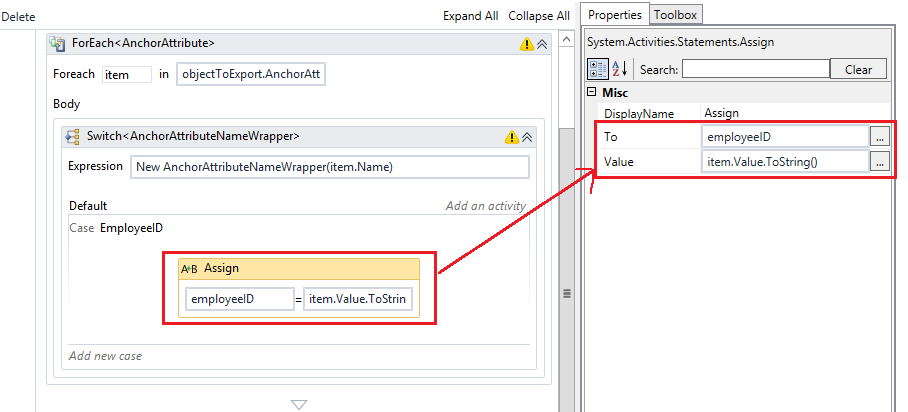

11.  Drag a **WebServiceCallActivity** presented under **Common and set Values for it’s Arguments.**

You should not change neither argument name nor direction nor argument type.If you accidentally changed any of them, the activity would become invalid. Only the `Value` column needs to set here. Like here `employeeID` which is a variable of type *string* is being set here.

12.  Finally add an **If** activity to check response return from web service operation. This is the end of Export-Add workflow creation. Refer below.

Save this project at the location: `%FIM_INSTALL_FOLDER%\Synchronization Service\Extensions`

### Configuring Export Work Flow in Config Tool (Replace operation):

1.  Click on the Export workflow to configure. Click on **Replace** under Export. **Arguments and Imports are already defined and are specific to the activities.** See below screen for reference.

2.  Add a Sequence activity.

3.  Drag a **forEach** activity for **\<AnchorAttribute\>.**

4.  Add another **ForEach\< AttributeChange \>** activity to assign values for non-anchor values.

5.  Finally screen looks like below. Detailed description to add these activities is already explained under `Export-Add`-- scenario above.

6.  Drag a **WebServiceCallActivity** presented under **Common and set Values for it’s Arguments.**

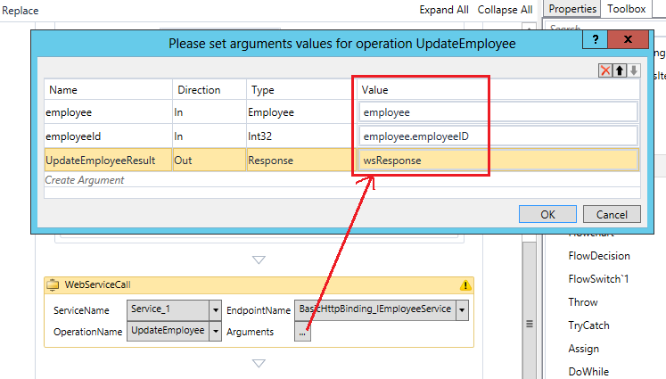

You should not change neither argument name nor direction nor argument type.If you accidentally changed any of them, the activity would become invalid. Only the *Value* column needs to set here. Like here ‘*wsResponse’* which is a variable of type *Response* is being set here and `employee` of type `Employee`.

7.  Finally add an `If` activity to check response return from web service operation. This is the end of Export-Add workflow creation.

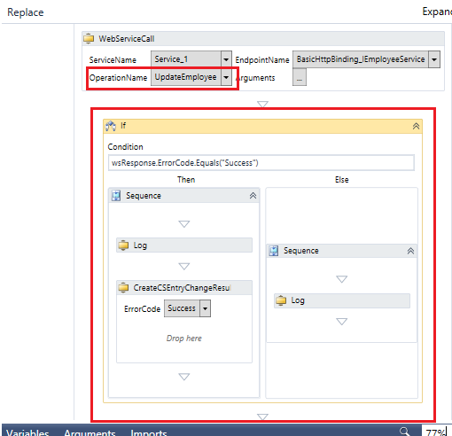

Save this project at the location: `%FIM_INSTALL_FOLDER%\Synchronization Service\Extensions`.

**Debug related activities**: Following custom activities are applicable when end user want to debug the workflow template.

| **Activity Name**                                                                                                    | *LogActivity*                                                                                                                                                                                                                                                                                                                                              |   |
|----------------------------------------------------------------------------------------------------------------------|------------------------------------------------------------------------------------------------------------------------------------------------------------------------------------------------------------------------------------------------------------------------------------------------------------------------------------------------------------|---|
| **Description**                                                                                                      | This activity is used to write text messages to the log file. For more information see, [Logging](https://social.technet.microsoft.com/wiki/contents/articles/21086.fim-2010-r2-troubleshooting-how-to-enable-etw-tracing-for-connectors.aspx). Generally, it is very helpful to do debugging in the production environment where you cannot debug your workflow easily.                                                       |   |
| **GUI**                                                                                                              |                                                                                                                                                                                                                                                                                                                                                            |   |
| **Usage**                                                                                                            | To use the log activity you must provide/set following properties. These properties are visible when you first select the activity in workflow designer and then go to Properties (right pane):-                                                                                                                                                           |   |
| **Activity Name**                                                                                                    | *WriteLine*                                                                                                                                                                                                                                                                                                                                                |   |
| **Description**                                                                                                      | This activity is used to write text messages to provider writer. If no writer is available, the [WriteLine](http://127.0.0.1:47873/help/1-7016/ms.help?method=page&id=T%3ASYSTEM.ACTIVITIES.STATEMENTS.WRITELINE&product=VS&productVersion=100&topicVersion=100&locale=EN-US&topicLocale=EN-US&embedded=true) activity writes its text out to the console. |   |
| **Note:** Console window is not available for you and it’s suggested that you provide your Writer for this activity. |                                                                                                                                                                                                                                                                                                                                                            |   |
| **GUI**                                                                                                              |                                                                                                                                                                                                                                                                                                                                                            |   |
| **Usage**                                                                                                            | In the text box please write your message which you want to be visible in the writer target.                                                                                                                                                                                                                                                               |   |

1.  **Log Level**: Choose one of the following values for Log level

2.  **High** – For writing the LogText message to the log file if the log severity is set to High.

3.  **Verbose** – For writing the LogText message to the log file is log severity is set to Verbose

4.  **Disabled** – Don’t write in log.
.
5.  **LogText:** Text which you want to write in Log.

6.  **Tag :** It could be one of the following :

7.  Error

8.  Trace

9.  Warning

## Next Steps

-   [Overview Generic Web Services Connector](microsoft-identity-manager-2016-ma-ws.md)

-   [Install the Web Service Config Tool](microsoft-identity-manager-2016-ma-ws-install.md)

-   [SOAP Based deployment guide](microsoft-identity-manager-2016-ma-ws-soap.md)

-   [Rest Based deployment guide](microsoft-identity-manager-2016-ma-ws-restgeneric.md)

-   [Web Service MA Configuration](microsoft-identity-manager-2016-ma-ws-maconfig.md)
